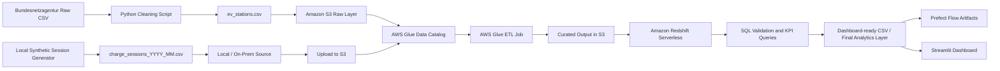

# EV Charging Demand and Utilization Pipeline on AWS

## Overview

This project builds an end-to-end data engineering pipeline for **EV charging demand analytics** using **one real-world dataset** and **one on-premise synthetic dataset**, then integrates them in AWS for analysis and dashboarding.

The project was designed to satisfy the module requirement of:

- merging **two data sources**
- using **object storage** and **on-premise files**
- loading and transforming data through a **pipeline**
- answering at least **two business objectives**
- proving that when **new data is added**, rerunning the pipeline updates the outputs

This project uses:

- **Amazon S3** for raw and curated storage
- **AWS Glue** for cataloging and transformation
- **Amazon Redshift Serverless** for warehouse storage and SQL analytics
- **Prefect** for orchestration and run monitoring
- **Streamlit** for dashboarding
- **Python** + **pandas** for data cleaning and synthetic data generation

---

## Business Problem

EV charging infrastructure is growing quickly, but operators still need visibility into:

1. **How charging demand changes across cities and months**
2. **How station/operator performance affects failures, queue times, and revenue**

This pipeline combines real station infrastructure data with synthetic charging-session activity data to support those business questions.

---

## Business Objectives

The pipeline supports the following business objectives:

### 1. Monthly charging demand and revenue analysis
Measure total sessions, average energy delivered, and estimated revenue by:

- city
- month
- charging type

### 2. Operator performance analysis
Measure operator-level performance using:

- failed session rate
- aborted session rate
- average queue wait time
- total revenue

## Tech Stack

- Amazon S3
- AWS Glue
- Amazon Redshift Serverless
- Prefect
- Streamlit
- Plotly
- Python
- pandas
- NumPy


## Data Sources

### 1. Source 1 — Real dataset (Object Storage Source)
A cleaned EV charging station dataset derived from the **Bundesnetzagentur charging station register**.
- Link: https://www.bundesnetzagentur.de/DE/Fachthemen/ElektrizitaetundGas/E-Mobilitaet/Ladesaeulenkarte/start.html

Final cleaned file:

- `ev_stations.csv`

This dataset contains:

- station ID
- city
- operator name
- postcode
- coordinates
- connector count
- charger power
- charging type

This file is stored in **Amazon S3** and serves as the **object storage source**.

###  2. Source 2 — Synthetic dataset (On-Premise Source)
Synthetic EV charging session files generated locally using Python and the real station IDs.

Files:

- `charge_sessions_2025_01.csv`
- `charge_sessions_2025_02.csv`
- `charge_sessions_2025_03.csv`
- `charge_sessions_2025_04.csv`

These files simulate:

- charging sessions
- energy delivered
- session duration
- failures and aborts
- queue wait times
- payment types
- estimated revenue

These files are created on the local machine and represent the **on-premise source**.


## Architecture



## Project Structure

```text
DE_Project/
├── dashboard/
│   └── app.py
├── data/
│   ├── raw/
│   │   └── Ladesaeulenregister_BNetzA_2026-02-27.csv
│   ├── real_source/
│   │   └── ev_stations.csv
│   ├── local_source/
│   │   ├── charge_sessions_2025_01.csv
│   │   ├── charge_sessions_2025_02.csv
│   │   ├── charge_sessions_2025_03.csv
│   │   └── charge_sessions_2025_04.csv
│   └── dashboard/
│       └── charge_sessions_enriched.csv
│
├── prefect_flows/
│   └── ev_charging_pipeline.py
├── scripts/
│   ├── clean_ev_stations.py
│   └── generate_sessions.py
│   
├── requirements.txt
└── README.md
```
---

## Pipeline Stages

### Stage 1 — Real station data cleaning
The raw Bundesnetzagentur file is cleaned using `clean_ev_stations.py`.

### Stage 2 — Synthetic session generation
Synthetic charging session files are generated locally using `generate_sessions.py`.

### Stage 3 — Raw storage in Amazon S3
The cleaned station file and synthetic session files are uploaded to Amazon S3.

### Stage 4 — AWS Glue cataloging and ETL
AWS Glue crawlers create raw catalog tables, and a Glue job joins station metadata with charging session data.

### Stage 5 — Data warehouse loading with Amazon Redshift Serverless
The curated Glue output is loaded into Amazon Redshift Serverless for SQL-based analytics.

### Stage 6 — Prefect orchestration
Prefect is used for flow execution, run monitoring, and artifact publishing.

### Stage 7 — Streamlit dashboard
A Streamlit dashboard is used to visualize KPI metrics, charts, and operator performance.

## How to Run
#### 1. Install dependencies

```bash
pip install -r requirements.txt
```
### 2. Clean the real station dataset
```bash
python scripts/clean_ev_stations.py
```
### 3. Generate synthetic charging sessions 
```bash
python scripts/generate_sessions.py --stations-file data/real_source/ev_stations.csv --output-dir data/local_source --start-month 2025-01 --months 3 --seed 42
```
### 4. Generate an additional month for rerun testing
```bash
python scripts/generate_sessions.py --stations-file data/real_source/ev_stations.csv --output-dir data/local_source --start-month 2025-04 --months 1 --seed 42
```
### 5. Upload files to Amazon S3
#### Upload cleaned station CSV
```bash
aws s3 cp data/real_source/ev_stations.csv s3://my-ev-project-bucket-2026/raw/real_stations/
```
#### Upload local session CSV files
```bash
aws s3 cp data/local_source/charge_sessions_2025_01.csv s3://my-ev-project-bucket-2026/raw/local_sessions/
aws s3 cp data/local_source/charge_sessions_2025_02.csv s3://my-ev-project-bucket-2026/raw/local_sessions/
aws s3 cp data/local_source/charge_sessions_2025_03.csv s3://my-ev-project-bucket-2026/raw/local_sessions/
aws s3 cp data/local_source/charge_sessions_2025_04.csv s3://my-ev-project-bucket-2026/raw/local_sessions/
```
### 6. Run AWS Glue crawlers and ETL job
- run crawler crw_ev_stations
- run crawler crw_ev_sessions
- verify that raw tables were created in database ev_charging_raw_db
- run ETL job job_ev_sessions_enriched

### 7. Load curated data into Amazon Redshift Serverless
- use namespace default-namespace
- use workgroup default-workgroup
- create schema ev_curated
- load the curated S3 output into table curated_charge_sessions_enriched
- run validation and KPI SQL queries


### 8.  Run Prefect flow
A rerun test was performed to verify that when new data is added, the pipeline updates the outputs correctly.

Steps:
1. A new file `charge_sessions_2025_04.csv` was generated locally.
2. The file was uploaded to Amazon S3.
3. The Glue ETL job was rerun.
4. The curated dataset and Redshift warehouse table were refreshed.
5. The Prefect summary and Streamlit dashboard reflected the updated data.

Result:
- total row count increased
- the latest month extended to April 2025
- KPI outputs changed accordingly
```bash
python prefect_flows/ev_charging_pipeline.py
```

### 7. Run Streamlit dashboard
#### Optional: Use the precomputed enriched CSV for dashboard

If you want to skip generating the enriched CSV locally:

1. Download `charge_sessions_enriched.csv` from [here](https://drive.google.com/file/d/1gTNsrihoe_D52zJLo-UptbEt2K9hrIBY/view?usp=sharing)
2. Place it in `data/dashboard/`
3. Run the Streamlit dashboard:
```bash
streamlit run dashboard/app.py
```

```markdown
## Rerun / Change Propagation Test

A rerun test was performed to verify that when new data is added, the pipeline updates the outputs correctly.

### Steps
1. A new file `charge_sessions_2025_04.csv` was generated locally.
2. The file was uploaded to Amazon S3.
3. The AWS Glue ETL job was rerun.
4. The curated dataset and Redshift warehouse table were refreshed.
5. The Prefect summary and Streamlit dashboard reflected the updated data.

### Result
- total row count increased
- the latest month extended to April 2025
- KPI outputs changed accordingly
```

## Prerequisites

Before running the project, make sure the following are available:

- Python 3.10 or later
- AWS account with access to Amazon S3, AWS Glue, and Amazon Redshift Serverless
- AWS CLI configured locally
- Prefect installed locally
- Streamlit installed locally

---
